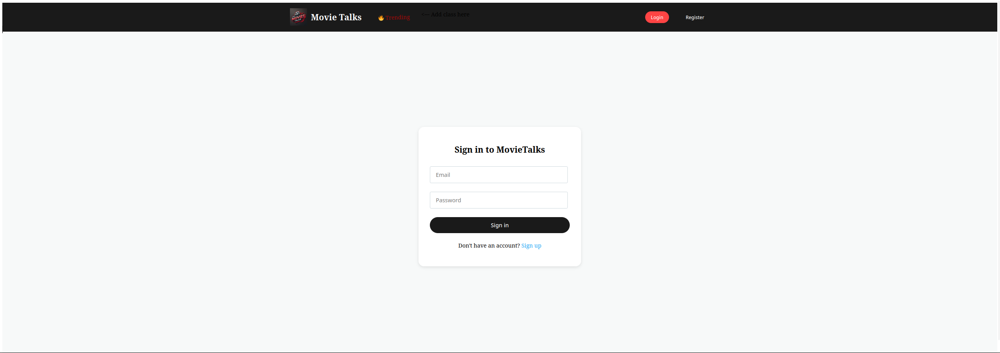
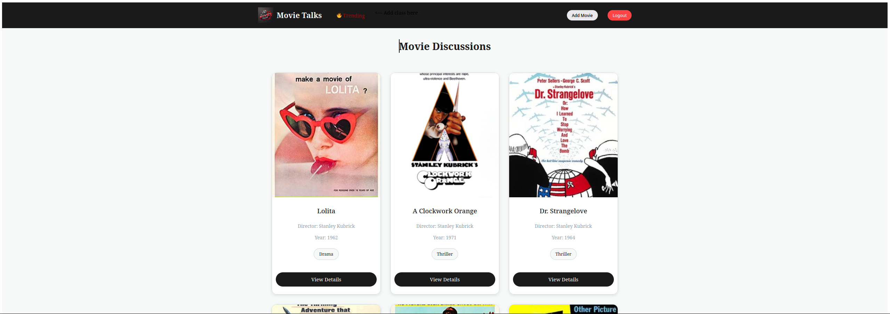
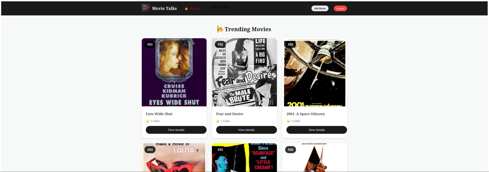
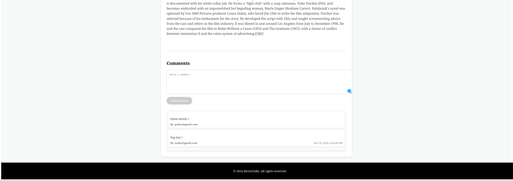
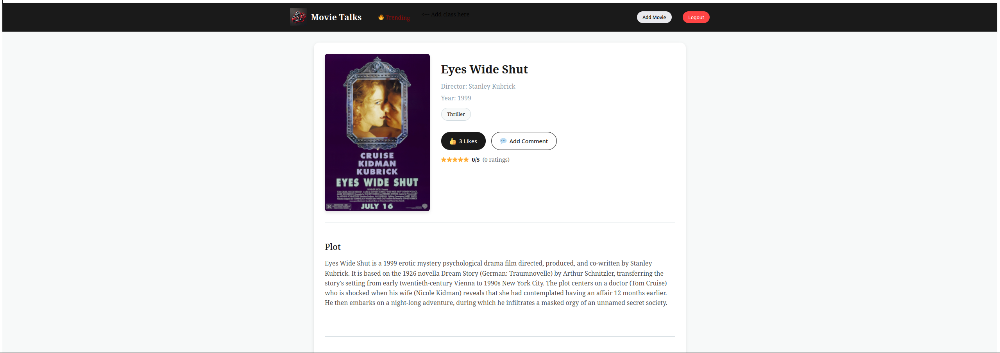
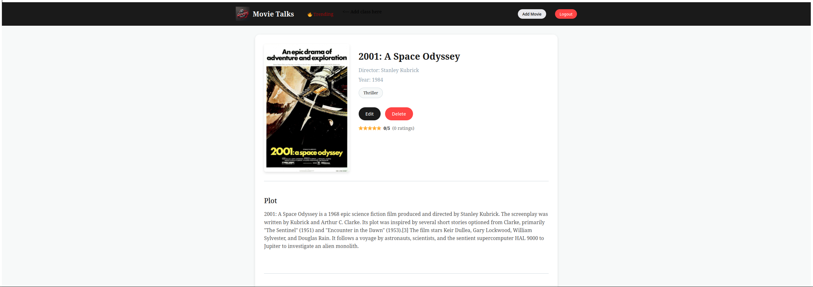
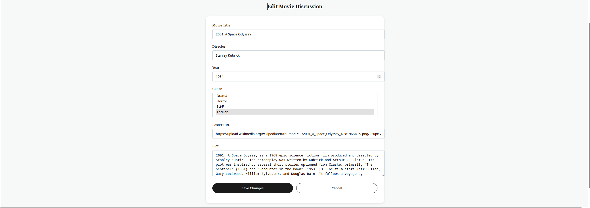

# Angular Movie Discussion Forum

A single-page application built with **Angular** and **Firebase** that allows users to discuss and share their thoughts about movies. The platform features user authentication, movie discussions, ratings, and real-time comments.

---

## You can visit the application at the following domains:

*   [jswebangularsoftuniexambackend.web.app](https://jswebangularsoftuniexambackend.web.app)
*   [jswebangularsoftuniexambackend.firebaseapp.com](https://jswebangularsoftuniexambackend.firebaseapp.com)

## Setup and Installation

This guide will walk you through setting up and running the Angular Movie Discussion Forum project.

**Prerequisites:**

*   Node.js (>= 16.x recommended) and npm (>= 8.x recommended) or yarn installed on your machine. Verify by running `node -v` and `npm -v`

## Environment Setup

1. Navigate to `/src/environments/`
2. Copy `environment.template.ts` to `environment.ts`
3. Replace the placeholder values in `environment.ts` with your Firebase configuration
4. For production, create `environment.prod.ts` with your production Firebase configuration

**Steps:**

1.  **Clone the Repository:**

    Clone the project repository:

    ```bash
    git clone <repository_url>
    ```

    Then, navigate to the project directory. The command to do this depends on your operating system and terminal:

    *   **macOS/Linux:**
        ```bash
        cd JsWeb_Angular_SoftUniExam
        ```
    *   **Windows (Command Prompt/PowerShell):**
        ```bash
        cd JsWeb_Angular_SoftUniExam  # Or the full path: cd C:\path\to\JsWeb_Angular_SoftUniExam
        ```
    *   **Windows (Git Bash):**
        ```bash
        cd JsWeb_Angular_SoftUniExam
        ```

2.  **Install Dependencies:**

    Navigate to the project directory and install dependencies:

    ```bash
    npm install
    ```

    This step is **essential**. It downloads all the project's dependencies. It is *not* part of `ng serve`.

3.  **Run the Application:**

    Start the development server:

    ```bash
    ng serve
    ```

    The application will be accessible at `http://localhost:4200`.

4.  **Run Tests (Optional):**

    To execute the unit tests:

    ```bash
    ng test
    ```

---

## Additional Information

*   The `package.json` file contains scripts for building (`ng build`), serving (`ng serve`), and testing (`ng test`) the application.
*   If you encounter any iss
## Key Features

- **User authentication and authorization**  
  

- **Movie catalog** with detailed views  
  

- **Discussion threads** for each movie  
  
  
- **Real-time comment system**  
  

- **Edit details as owner** with favorite movies and contribution history  
  

- **Rating and review system**  
  

---

## Tech Stack

- **Frontend**: Angular 18.2.12  
- **UI Components**: Angular Material  
- **State Management**: RxJS  
- **Styling**: SCSS  
- **Backend**: Firebase  
- **Deployment**: Firebase Hosting  

---

## Project Requirements  

This project was developed as part of an **Angular course assignment**, implementing:  

- Dynamic page routing  
- CRUD operations  
- User authentication  
- Responsive design  
- TypeScript with strict typing  
- RxJS operators  
- Angular lifecycle hooks  
- Route guards  
- Error handling  
- Component styling  

---
